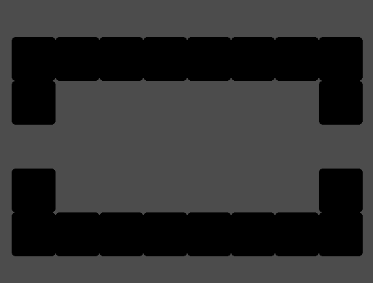

## Scene Based Level Gen
Heres my implementation of scene based level generation from my current game project. The code doesn't work because its out of context of the whole engine but the base theory is there so it can work in any engine with a little bit of work!

## What is Scene Based Level Gen
Scene based level gen is bascalliy just away of spawning rooms, except each room is its own scene which makes it easier to make and design rooms!

## Built With 
- [C#](https://en.wikipedia.org/wiki/C_Sharp_(programming_language))
- [Godot](https://godotengine.org/)

## Screenshot

## License
Licensed under the MIT License
